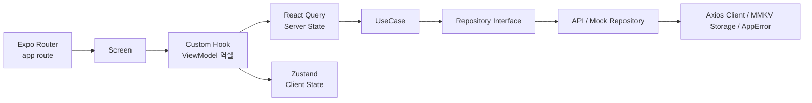

# Dogether React Native

### **개요**

- 프로젝트 기간: 2025.03
- 인원: 개인 프로젝트
- 기술스택: **React Native** · **Expo** · **TypeScript** · **Expo Router** · **React Query** · **Zustand** · **MMKV** · **Axios** · **Zod**

---

### 서비스 설명

iOS로 구현했던 Dogether의 주요 앱 플로우를 React Native로 재구현하며 크로스플랫폼 화면 구성, 파일 기반 라우팅, 서버 상태 캐싱, 전역 상태 관리, 데이터 계층 분리를 학습한 프로젝트

---

### 구조

---

### **주요성과**

- **Screen · Custom Hook · UseCase · Repository 계층 분리로 화면 책임 정리**
    - Screen은 UI 조립과 이벤트 연결에 집중하고, 파생 상태와 핸들러는 Custom Hook, 기능 흐름은 UseCase, 데이터 접근은 Repository로 분리

- **React Query와 Zustand로 서버 상태 / 클라이언트 상태 분리**
    - 그룹 목록, 투두, 랭킹, 통계처럼 원격 데이터는 React Query에서 캐싱하고, 선택 그룹, 날짜 오프셋, 필터, 세션, 토스트 등 앱 내부 상태는 Zustand에서 관리

- **Expo Router 기반 파일 라우팅 흐름 정리**
    - `app/` 폴더의 파일 구조를 화면 경로로 사용하고, `_layout.tsx`에서 Stack 화면과 전역 Provider를 구성해 앱 시작, 그룹, 메인, 인증, 설정 플로우를 관리

- **Repository Interface와 API/Mock 구현체 분리**
    - contracts, impl, mock 계층을 나누고 환경변수에 따라 실제 API 구현체와 Mock 구현체를 교체할 수 있도록 Repository factory를 구성

- **공통 Axios Client · MMKV Storage · AppError로 외부 의존성 표준화**
    - 인증 헤더, 로컬 세션 저장, 서버 에러 변환을 공통 계층으로 모아 Screen이 네트워크와 저장소 구현 세부사항에 직접 의존하지 않도록 구성

---

### iOS에서 React Native로 전환하며 달라진 설계 기준

#### **1. ViewController 중심 화면 구성에서 Screen + Hook 중심 구성으로 전환**

- **기존 iOS 구조**: ViewController가 ViewModel을 구독하고 UIKit view의 속성과 이벤트를 직접 연결
- **React Native에서의 접근**: Screen은 JSX로 화면을 선언하고, 화면에 필요한 상태 계산과 이벤트 핸들러는 Custom Hook에서 조합
- **전환하며 느낀 차이**: RN에서는 화면 컴포넌트가 렌더링마다 다시 실행되기 때문에, ViewModel 역할을 클래스가 아니라 Hook의 반환값과 파생 상태 중심으로 설계하는 사고가 중요했음

#### **2. RxSwift 상태 스트림에서 React Query / Zustand 기반 상태 관리로 전환**

- **기존 iOS 구조**: Relay/Observable을 ViewModel이 소유하고 ViewController가 구독해 화면을 갱신
- **React Native에서의 접근**: 서버에서 받아오는 데이터는 React Query, 앱이 직접 소유하는 UI 상태와 세션은 Zustand, 화면 내부 상태는 `useState`로 분리
- **전환하며 느낀 차이**: 하나의 ViewModel에 상태를 모으기보다 상태의 성격에 따라 query, store, local state로 나누는 편이 RN에서는 더 자연스러웠음

#### **3. Coordinator 기반 화면 전환에서 Expo Router 파일 라우팅으로 전환**

- **기존 iOS 구조**: Coordinator가 ViewController 생성, push/pop, root 교체, modal 전환 정책을 관리
- **React Native에서의 접근**: `app/main.tsx`, `app/group-create.tsx`처럼 파일이 route가 되고, `router.push` / `router.replace`로 경로 기반 전환을 수행
- **전환하며 느낀 차이**: 화면 인스턴스를 직접 생성하기보다 URL path와 파일 구조를 기준으로 플로우를 구성하며, 공통 Stack 설정은 `_layout.tsx`에 모으는 방식이 더 자연스러웠음

#### **4. ViewModel의 데이터 요청 책임을 React Query Hook으로 이전**

- **기존 iOS 구조**: ViewModel이 UseCase를 호출하고 로딩, 성공, 실패 상태를 직접 Relay로 관리
- **React Native에서의 접근**: `useGroupsQuery`, `useMyTodosQuery`, `useRankingQuery`처럼 조회 단위별 Query Hook을 만들고 캐싱, 로딩, 에러, 리패치 상태를 React Query에 위임
- **전환하며 느낀 차이**: 서버 상태를 직접 전역 store에 저장하면 캐시 만료와 재요청 정책까지 직접 관리해야 했고, React Query를 사용하니 화면은 query result를 구독하고 표현하는 역할에 더 집중할 수 있었음

#### **5. DIManager 방식에서 환경 기반 Repository Factory로 전환**

- **기존 iOS 구조**: DIManager가 Protocol 타입에 실제 구현체 또는 Mock 구현체를 주입
- **React Native에서의 접근**: Repository contract를 TypeScript interface로 정의하고, `env.useMockGroups` 같은 런타임 환경값에 따라 API 구현체와 Mock 구현체를 factory에서 선택
- **전환하며 느낀 차이**: Swift의 Protocol 기반 의존성 분리 기준은 RN에서도 유효했고, TypeScript interface와 factory 함수만으로도 화면과 UseCase가 구현체 세부사항을 모르는 구조를 만들 수 있었음

#### **6. 네이티브 저장소 중심 세션 관리에서 Zustand + MMKV 조합으로 전환**

- **기존 iOS 구조**: Keychain/UserDefaults와 앱 시작 플로우에서 인증 상태를 읽고 화면 분기를 결정
- **React Native에서의 접근**: MMKV에 세션과 선택 그룹을 저장하고, 앱 시작 시 Zustand store를 hydrate한 뒤 Splash, Onboarding, Start, Main 플로우를 분기
- **전환하며 느낀 차이**: 저장소에 값이 있는지와 메모리 store가 준비됐는지를 구분해야 했고, `hydrated` 상태를 따로 두어 앱 시작 시점의 화면 분기를 안정적으로 관리할 수 있었음

#### **7. 플랫폼별 네이티브 기능을 공통 플로우 안에 연결**

- **기존 iOS 구조**: 카카오/애플 로그인, 이미지 선택, 인증 업로드 같은 기능을 iOS 네이티브 API와 직접 연결
- **React Native에서의 접근**: Expo와 RN 라이브러리를 통해 로그인, 이미지 피커, 파일 업로드, 권한 요청을 공통 화면 플로우에 연결
- **전환하며 느낀 차이**: RN이 플랫폼 차이를 줄여주지만 완전히 없애지는 않았고, 로그인 복귀, 이미지 권한, 네이티브 모듈 설정처럼 플랫폼 경계와 맞닿는 부분은 iOS와 Android 동작을 함께 이해해야 안정적으로 다룰 수 있었음
