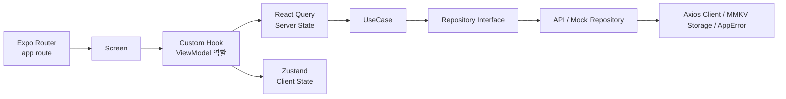

# Dogether React Native

### **개요**

- 프로젝트 기간: 2025.03
- 인원: 개인 프로젝트
- 기술스택: **React Native** · **Expo** · **TypeScript** · **Expo Router** · **React Query** · **Zustand** · **MMKV** · **Axios** · **Zod**

---

### 서비스 설명

iOS로 구현했던 Dogether의 주요 앱 플로우를 React Native로 재구현하며 크로스플랫폼 화면 구성, 파일 기반 라우팅, 서버 상태 캐싱, 전역 상태 관리, 데이터 계층 분리를 학습한 프로젝트

---

### 구조

---

### **주요성과**

- **Screen · Custom Hook · UseCase · Repository 계층 분리로 화면 책임 정리**
    - Screen은 UI 조립과 사용자 이벤트 연결에 집중
    - Custom Hook은 화면에 필요한 파생 상태와 핸들러를 조합
    - UseCase는 화면에서 호출하는 기능 흐름을 담당
    - Repository는 실제 API 또는 Mock 데이터 접근을 담당

- **React Query와 Zustand로 서버 상태 / 클라이언트 상태 분리**
    - 그룹 목록, 투두, 랭킹, 통계 등 원격 데이터는 React Query에서 관리
    - 로딩, 에러, 캐싱, 리패치 흐름은 Query Hook 단위로 분리
    - 선택 그룹, 날짜 오프셋, 필터, 토스트 등 UI 상태는 Zustand에서 관리
    - 로그인 세션처럼 앱 재실행 후에도 필요한 값은 MMKV와 함께 관리

- **Expo Router 기반 파일 라우팅 흐름 정리**
    - `app/` 폴더의 파일 구조를 화면 경로로 사용
    - `_layout.tsx`에서 Stack 화면과 전역 Provider를 구성
    - 앱 시작, 그룹 생성/참여, 메인, 인증, 설정 플로우를 route 단위로 분리
    - 화면 이동은 `router.push` / `router.replace` 기반으로 정리

- **Repository Interface와 API/Mock 구현체 분리**
    - `contracts/`에서 Repository 계약을 TypeScript interface로 정의
    - `impl/`에는 실제 API 호출 구현체를 배치
    - `mock/`에는 서버 없이 동작하는 Mock 구현체와 더미 데이터를 배치
    - 환경변수에 따라 Repository factory에서 API 구현체와 Mock 구현체를 선택

- **공통 Axios Client · MMKV Storage · AppError로 외부 의존성 표준화**
    - Axios Client에서 baseURL, timeout, 인증 헤더 주입을 공통 처리
    - MMKV Storage 계층에서 세션과 선택 그룹 같은 로컬 값을 관리
    - 서버 에러 응답은 AppError 모델로 변환
    - Screen은 네트워크와 저장소 구현 세부사항에 직접 의존하지 않도록 구성

---

### iOS에서 React Native로 전환하며 달라진 설계 기준

#### **1. ViewController 중심 화면 구성에서 Screen + Hook 중심 구성으로 전환**

- **기존 iOS 구조**: ViewController가 ViewModel을 구독하고 UIKit view의 속성과 이벤트를 직접 연결
- **React Native에서의 접근**
    - Screen은 JSX로 현재 상태에 맞는 화면을 선언
    - 화면에 필요한 파생 상태는 Custom Hook에서 계산
    - 사용자 이벤트 핸들러도 Custom Hook에서 조합해 Screen에 전달
- **전환하며 느낀 차이**
    - RN의 화면 컴포넌트는 상태 변경마다 다시 실행되는 함수에 가까웠음
    - ViewModel 역할을 클래스 인스턴스가 아니라 Custom Hook의 반환값으로 표현
    - 화면 상태는 직접 소유하기보다 계산해서 전달하는 방식으로 바라보는 것이 중요했음

#### **2. RxSwift 상태 스트림에서 React Query / Zustand 기반 상태 관리로 전환**

- **기존 iOS 구조**: Relay/Observable을 ViewModel이 소유하고 ViewController가 구독해 화면을 갱신
- **React Native에서의 접근**
    - 서버에서 받아오는 데이터는 React Query Hook으로 분리
    - 앱이 직접 소유하는 UI 상태와 세션은 Zustand에서 관리
    - 화면 내부에서만 필요한 값은 `useState`로 유지
- **전환하며 느낀 차이**
    - 하나의 ViewModel에 모든 상태를 모으는 방식보다 상태 성격별 분리가 자연스러웠음
    - 서버 상태는 캐싱, 만료, 리패치 정책까지 함께 고려해야 했음
    - 화면은 데이터를 직접 관리하기보다 query result를 구독하고 표현하는 역할에 가까워졌음

#### **3. Coordinator 기반 화면 전환에서 Expo Router 파일 라우팅으로 전환**

- **기존 iOS 구조**: Coordinator가 ViewController 생성, push/pop, root 교체, modal 전환 정책을 관리
- **React Native에서의 접근**
    - `app/main.tsx`, `app/group-create.tsx`처럼 파일을 route로 사용
    - `router.push` / `router.replace`로 경로 기반 화면 전환을 수행
    - `_layout.tsx`에서 공통 Stack 설정과 전역 Provider를 구성
- **전환하며 느낀 차이**
    - 화면 인스턴스를 직접 생성하기보다 URL path를 기준으로 플로우를 설계
    - 파일 구조만으로 화면 목록과 route 흐름이 드러나는 점이 직관적이었음
    - 전환 책임이 분산될 수 있어 route 이름과 파일 배치를 일관되게 관리하는 것이 중요했음

#### **4. ViewModel의 데이터 요청 책임을 React Query Hook으로 이전**

- **기존 iOS 구조**: ViewModel이 UseCase를 호출하고 로딩, 성공, 실패 상태를 직접 Relay로 관리
- **React Native에서의 접근**
    - `useGroupsQuery`, `useMyTodosQuery`, `useRankingQuery`처럼 조회 단위별 Query Hook을 구성
    - UseCase 호출은 Query Hook 내부로 모아 Screen에서 분리
    - 캐싱, 로딩, 에러, 리패치 상태는 React Query에 위임
- **전환하며 느낀 차이**
    - 서버 상태를 전역 store에 저장하면 캐시 만료와 재요청 정책까지 직접 관리해야 했음
    - React Query를 사용하니 화면은 query result를 구독하고 표현하는 역할에 집중할 수 있었음
    - 데이터 요청 로직이 Hook 단위로 모이면서 화면별 로딩/에러 처리 흐름을 더 명확하게 볼 수 있었음

#### **5. DIManager 방식에서 환경 기반 Repository Factory로 전환**

- **기존 iOS 구조**: DIManager가 Protocol 타입에 실제 구현체 또는 Mock 구현체를 주입
- **React Native에서의 접근**
    - Repository contract를 TypeScript interface로 정의
    - 실제 API 구현체와 Mock 구현체가 같은 contract를 따르도록 구성
    - `env.useMockGroups` 같은 런타임 환경값에 따라 factory에서 구현체를 선택
- **전환하며 느낀 차이**
    - Swift의 Protocol 기반 의존성 분리 기준은 RN에서도 유효했음
    - TypeScript interface와 factory 함수만으로도 구현체 교체 구조를 만들 수 있었음
    - 화면과 UseCase가 API/Mock 여부를 알지 않아도 되는 점이 유지보수에 도움이 됐음

#### **6. 네이티브 저장소 중심 세션 관리에서 Zustand + MMKV 조합으로 전환**

- **기존 iOS 구조**: Keychain/UserDefaults와 앱 시작 플로우에서 인증 상태를 읽고 화면 분기를 결정
- **React Native에서의 접근**
    - MMKV에 로그인 세션과 마지막 선택 그룹을 저장
    - 앱 시작 시 MMKV 값을 Zustand store로 hydrate
    - hydrate 이후 Splash, Onboarding, Start, Main 플로우를 분기
- **전환하며 느낀 차이**
    - 저장소에 값이 있는지와 메모리 store가 준비됐는지를 구분해야 했음
    - `hydrated` 상태를 따로 두어 앱 시작 시점의 화면 분기를 안정적으로 관리
    - 세션성 데이터와 화면 UI 상태를 같은 store에 섞지 않는 것이 중요했음

#### **7. 플랫폼별 네이티브 기능을 공통 플로우 안에 연결**

- **기존 iOS 구조**: 카카오/애플 로그인, 이미지 선택, 인증 업로드 같은 기능을 iOS 네이티브 API와 직접 연결
- **React Native에서의 접근**
    - Expo와 RN 라이브러리로 로그인, 이미지 피커, 파일 업로드, 권한 요청을 연결
    - 공통 화면 플로우 안에서 iOS와 Android 동작을 함께 처리
    - 네이티브 모듈 설정은 app config와 플랫폼별 설정 파일에서 관리
- **전환하며 느낀 차이**
    - RN이 플랫폼 차이를 줄여주지만 완전히 없애주지는 않았음
    - 로그인 복귀, 이미지 권한, 파일 경로처럼 플랫폼 경계와 맞닿는 부분에서 차이가 드러났음
    - 안정적으로 디버깅하려면 JS 코드뿐 아니라 iOS와 Android 네이티브 동작도 함께 이해해야 했음
